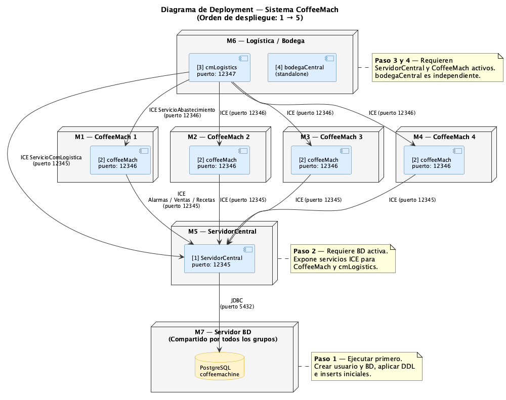

# Informe de Deployment
## Sistema CoffeeMach — Tarea 5

---

**Autores:**  
Juan Jose Vidarte, Sebastian Castillo, Santiago Zapata, Juan David Salazar, Jose Miguel Armas

**Repositorio:** https://github.com/scastillop05/CoffeeMachine_T5  
**Rama:** main

---

## Diagrama de Deployment



---

## 1. Descripción general del sistema

CoffeeMach es un sistema distribuido de gestión de máquinas expendedoras de café. Su arquitectura está compuesta por cinco módulos que se comunican entre sí mediante el middleware **ZeroC ICE**, a través de interfaces definidas en el archivo Slice `CoffeMach.ice`.

| Módulo | Descripción |
|---|---|
| PostgreSQL | Base de datos relacional central. Almacena información de máquinas, operadores, alarmas, recetas y ventas. |
| ServidorCentral | Servidor ICE. Coordina operadores, máquinas asignadas, registro de alarmas y ventas. |
| CoffeeMach | Interfaz gráfica de la máquina expendedora. Procesa ventas, gestiona ingredientes y emite alarmas. |
| cmLogistics | Cliente de consola para operadores de logística. Consulta alarmas activas y envía órdenes de abastecimiento. |
| bodegaCentral | Aplicación de escritorio para gestión del inventario físico de bodega. Opera de forma independiente. |

---

## 2. Implementación — Segunda parte

### 2.1 Módulo cmLogistics

Este módulo fue implementado desde cero como cliente de consola ICE. Su propósito es permitir a un operador de logística autenticarse, consultar el estado de las máquinas asignadas y resolver alarmas de desabastecimiento.

**Flujo de operación:**

1. El comunicador ICE se inicializa con la configuración definida en `CmLogistic.cfg`.
2. Se crea un proxy de tipo `ServicioComLogisticaPrx` apuntando al ServidorCentral en el puerto 12345.
3. Se crea un proxy de tipo `ServicioAbastecimientoPrx` apuntando a la CoffeeMach en el puerto 12346.
4. Se lanza `ConsolaLogistica.iniciar()`, que ejecuta el siguiente flujo interactivo:
   - Autenticación mediante `inicioSesion(codOperador, password)`.
   - Menú de opciones: ver máquinas asignadas, ver alarmas activas, resolver alarma, salir.
   - La resolución de una alarma invoca `abastecer(codMaquina, idAlarma)` directamente sobre la CoffeeMach correspondiente.

**Archivos creados:**

| Archivo | Descripción |
|---|---|
| `cmLogistics/src/main/java/CmLogistics.java` | Punto de entrada. Inicializa ICE y lanza la consola. |
| `cmLogistics/src/main/java/logistica/ConsolaLogistica.java` | Lógica del menú interactivo. |
| `cmLogistics/src/main/resources/CmLogistic.cfg` | Configuración de endpoints ICE. |

### 2.2 Módulo bodegaCentral

Este módulo fue implementado desde cero como aplicación de escritorio Swing independiente. Gestiona el inventario físico de la bodega sin requerir conectividad ICE.

**Arquitectura interna:**

- `BodegaImpl`: implementa la interfaz `Bodega`. Mantiene el inventario en estructuras `LinkedHashMap`. Stock inicial configurado según los datos de la base de datos.
- `InventarioImpl`: implementa la interfaz `Inventario`. Delega en `BodegaImpl` para reabastecer existencias con cantidades predefinidas.
- `Interfaz`: ventana principal `JFrame` con diez botones de operación que invocan métodos de `BodegaImpl` e `InventarioImpl`. El resultado de cada operación se muestra en un área de texto.

**Stock inicial:**

| Categoría | Ítem | Cantidad |
|---|---|---|
| Ingredientes | Agua | 10.000 |
| Ingredientes | Cafe | 5.000 |
| Ingredientes | Azucar | 5.000 |
| Ingredientes | Vaso | 200 |
| Monedas | $100 | 100 |
| Monedas | $200 | 100 |
| Monedas | $500 | 100 |
| Suministros | Kit de reparación | 5 |

**Archivos creados o modificados:**

| Archivo | Descripción |
|---|---|
| `bodegaCentral/src/main/java/BodegaCentral.java` | Punto de entrada. Lanza la interfaz gráfica. |
| `bodegaCentral/src/main/java/bodega/BodegaImpl.java` | Implementación de la interfaz `Bodega`. |
| `bodegaCentral/src/main/java/mantenimientoExistencias/InventarioImpl.java` | Implementación de la interfaz `Inventario`. |
| `bodegaCentral/src/main/java/guiInventario/Interfaz.java` | Ventana principal Swing. |

---

## 3. Configuración para pruebas locales

Los siguientes archivos fueron modificados para adaptar el sistema a un entorno local. Para el despliegue en laboratorio deben restaurarse los valores originales.

| Archivo | Parámetro | Valor original | Valor local |
|---|---|---|---|
| `ServidorCentral/src/main/resources/server.cfg` | Puerto BD | 5430 | 5432 |
| `ServidorCentral/src/main/resources/server.cfg` | Password BD | cofmachpwd | cofmachu |
| `coffeeMach/src/main/resources/coffeMach.cfg` | IPs de máquinas | 10.147.19.x | localhost |
| `scripts/postgres/coffeemach-user.sql` | Password usuario BD | cofmachpwd | cofmachu |

---

## 4. Procedimiento de deployment

El orden de despliegue debe respetarse estrictamente, de menor a mayor dependencia: Base de datos → ServidorCentral → CoffeeMach → cmLogistics → bodegaCentral.

### 4.1 Base de datos (M7)

```bash
psql -U <usuario_admin> -d postgres -f scripts/postgres/coffeemach-user.sql
psql -U cofmachu -d coffeemachine -f scripts/postgres/coffeemach-ddl.sql
psql -U cofmachu -d coffeemachine -f scripts/postgres/coffeemach-inserts.sql
```

### 4.2 ServidorCentral (M5)

```bash
./gradlew :ServidorCentral:jar
java -jar ServidorCentral/build/libs/ServidorCentral.jar
```

Puerto de escucha: **12345**

### 4.3 CoffeeMach (M1 – M4)

```bash
./gradlew :coffeeMach:jar
java -jar coffeeMach/build/libs/coffeeMach.jar
```

Puerto de escucha: **12346**

### 4.4 cmLogistics (M6)

```bash
./gradlew :cmLogistics:jar
java -jar cmLogistics/build/libs/cmLogistics.jar
```

Puerto de escucha: **12347**  
Credenciales de prueba: operador `1`, contraseña `1123`

### 4.5 bodegaCentral (M6 — componente independiente)

```bash
./gradlew :bodegaCentral:jar
java -jar bodegaCentral/build/libs/bodegaCentral.jar
```

No requiere otros componentes activos.

---

## 5. Resultados de las pruebas

Las siguientes pruebas fueron realizadas en entorno local (macOS, Java 22, PostgreSQL 14, ZeroC ICE 3.7).

| N.° | Prueba | Resultado |
|---|---|---|
| 1 | Creación de base de datos, tablas y datos iniciales | Aprobado |
| 2 | ServidorCentral arranca y escucha en puerto 12345 | Aprobado |
| 3 | CoffeeMach carga GUI con recetas e ingredientes | Aprobado |
| 4 | cmLogistics: autenticación con operador 1 / contraseña 1123 | Aprobado |
| 5 | cmLogistics: listado de máquinas asignadas (3 máquinas) | Aprobado |
| 6 | cmLogistics: listado de alarmas activas (4 alarmas) | Aprobado |
| 7 | cmLogistics: resolución de alarma, llamada abastecer(1,1) recibida en CoffeeMach | Aprobado |
| 8 | bodegaCentral: GUI inicia con stock inicial correcto | Aprobado |

---

## 6. Historial de commits

| Hash | Descripción |
|---|---|
| bbccfc1 | config: ajustar IPs y credenciales para pruebas locales |
| 9eb0ade | feat: implementar cmLogistics y bodegaCentral para resolución de alarmas |
| 67d1054 | Codigo base del sistema CoffeeMach |
